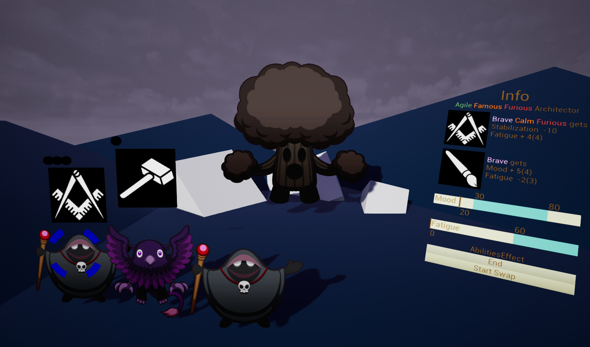

# Workshop

This is an open part of a developing game. Although this game has some specifics, presented classes and functions can be useful to build a prototype or have a look at Unreal Engine's possibilities. If you have any recommendations or questions, you are always welcome!

### Few words about the game

For now a short description reads: "Journey about rethinking the values of life in form of turn-based videogame. Combine abilities of diverse craftsmen to fight challenges in massive construction based on taming figurative beasts". As this game has no budget it's made by open community, so if you want to participate in development or just send some ideas and check news there is a discord channel for that: https://discord.gg/sazKY9J

Also you can check [gameplay presentation](https://docs.google.com/presentation/d/161Je4Ib8IKuVyrYAJI6qKCj3mGKBmazKgrtVzlb5TDs/edit?usp=sharing), to see what ideas stay behind this game.

### Repository Structure

**Source/Workshop** contains all needed code:

- **ActorClasses** has all visually represented classes.
- **Builders** contains functions to compose events faster in Blueprint.
- **PlayerControl** is responsible for player's input, saved data and other possible interaction with the game.
- **Types** gathers structs, enums and classes with aim to transfer information between other objects.
- **UI** holds Widgets and HUD apart from other classes because of unique parent classes.

Used names:

- **CT** stays for Custom Tag. It's used for search purposes (for example, you want to find all People and Flowers on the level). Expected to be used when there are a lot of CTs in general, but objects only have few.
- **Interactive** refers to an often used class with some specifics such as connection to Manager, having influence on other Interactive objects,  (for example, in-game characters, items, but not UI).
- **Core** (DataCore) is object's data which describes it regardless of other objects and current game situation and can travel through levels  (for example, rendered models and sprites, numbers and strings, but not pointers to any objects or transform).

### Assets

[RPG Monster Pack](https://pipoya.itch.io/free-rpg-monster-pack)

https://game-icons.net/

https://craftpix.net/freebies/free-horizontal-2d-game-backgrounds/

### Screenshots

